# Kickstart RT SDK Reference

Table of contents  
[1. Overview and Execution Flow](#1-overview-and-execution-flow)  
[2. NameSpace and Class structures](#2-namespace-and-class-structures)  
[3. Handles](#3-handles)  
[4. Threading](#4-threading)  
[5. Mutex and Blocking Conditions in the SDK](#5-mutex-and-blocking-conditions-in-the-sdk)  
[6. Input Resources](#6-input-resources)  
[7. D3D11 interlop layer](#7-d3d11-interlop-layer)  
[8. Internal Resources](#8-internal-resources)  

## 1. Overview and Execution Flow
This chapter explains the basic flow of the SDK through its simplest usage. While the details of each process are not explained completely here, we will attempt to provide enough information to cover all high level concepts and flow.  
A diagram of the process flow is shown below.

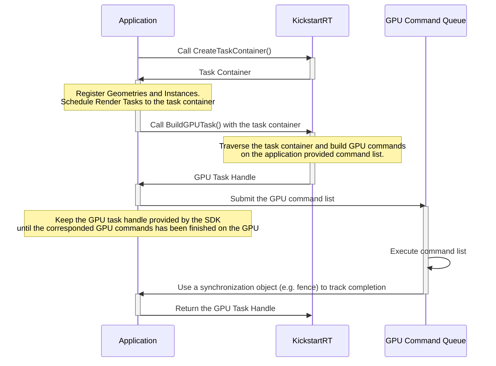

After initializing the SDK, the first task in the rendering loop is to create a TaskContainer. A TaskContainer is a structure used to pass various input data to the SDK and to have the SDK perform operations for your engine.  It serves as the fundamental interface to all operations in the Kickstart RT SDK.

After TaskContainer creation, you will add a Task to register the geometries in the scene. The registered geometries are used in the SDK to build the Acceleration Structure (BVH). Additionally, you should register a Task to render reflections and/or GI to the TaskContainer. 

To render raytraced reflections and GI in KickStart RT, you will need the location of the geometries directly visible from the viewpoint, their surface normals, roughness and various values, as well as the direct light shading results. These should be drawn to the 2D render targets in a conventional deferred render pass, so simply register the drawn buffers as input data.

Next, the application passes the TaskContainer, along with a command list, to the SDK to build the rendering commands into it.  This command list will build the acceleration structure based on the input data and performs ray tracing to draw the output to the specified render targets.

In order to integrate the result into a final render, the application will need to add a rendering path to composite the reflection and/or GI rendering results written by the command list from the SDK.

Finally, once the application is done executing the command list on the GPU, it must tell the SDK that the execution is complete.

Note that once the geometry has been input into the SDK, it will persist in the scene. Thus, once static geometry has been registered, it can be left as is. In subsequent frames, the application only needs to update the geometries whose position have changed, or add/remove them if their visibility has changed. This will update the acceleration structure in the SDK.

The direct light rendering input to the SDK is stored in a cache built in world space. Therefore, as multiple frames are rendered from different views, the SDK accumulates the direct light rendering which persists outside of the current view of the GBuffer. This is then sampled by ray tracing to achieve GI and reflection.

## 2. NameSpace and Class structures
This section describes the overall structure of Namespace, Class, and Structure exposed by the SDK. For detailed information on individual items, please refer to the source code headers as an API reference. The following diagram illustrates the namespace structure of the SDK.

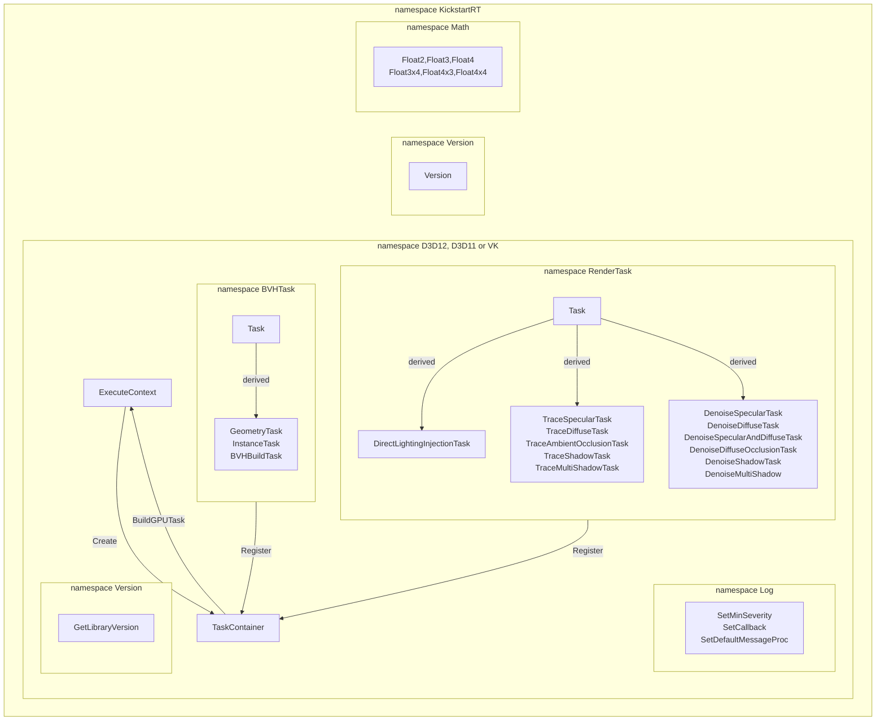

#### ExecuteContext
ExecuteContext is an instance of the SDK itself. It is expected that there is only one instance per application. It persists until it is destroyed explicitly, and holds D3D or Vulkan resources inside it.  
ExecuteContext has the interface for the creation and destruction of GeometryHandle, InstanceHandle and DenoisingContextHandle, which are necessary for building the Acceleration Structure and for managing intermediate render targets for denoising the ray tracing results. 
<!-- Modified - begin -->
Also, it has an interface for generating Task Containers which are used to build a command list to execute rendering, described in the following section. 
<!-- Modified - end -->

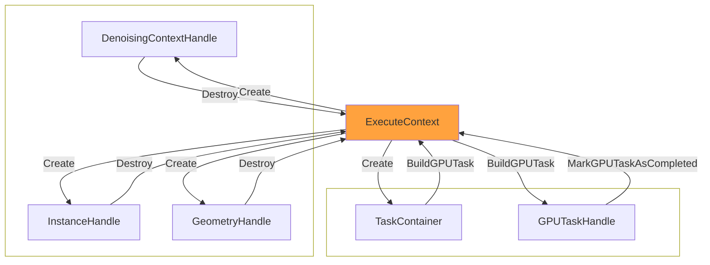

#### TaskContainer
A TaskContainer is created from an ExecuteContext. By inputting a BVHTask and a RenderTask (described below) into the TaskContainer, it can represent the processing unit of a command list generated by the SDK. A TaskContainer is destroyed when it is handed over to the ExecuteContext as an input for the SDK's command list creation process. Multiple TaskContainers can be created simultaneously, and multiple threads can access different TaskContainers without blocking by mutex.

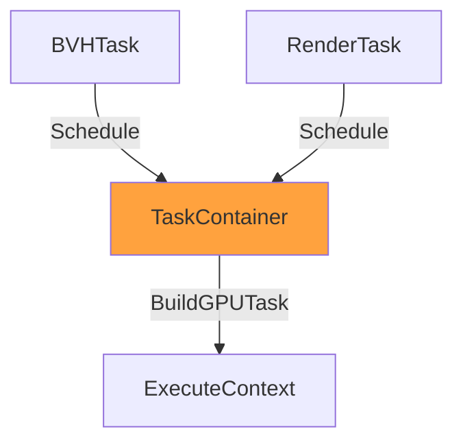

#### Tasks
There are two types of Task: `BVHTask::Task` and `RenderTask::Task`. Both are base structures, and various tasks are derived from these structures. Tasks are stored in the TaskContainer which is eventually passed to the ExecuteContext to generate individual tasks as GPU drawing commands.

###### BVH tasks
There are three types of BVHTask. `GeometryTask` and `InstanceTask` are structures that represent the input data for the tasks to register and update the geometry information to be placed in the scene. `BVHBuildTask` is to control the timing of building BLAS and TLAS of acceleration structures. 

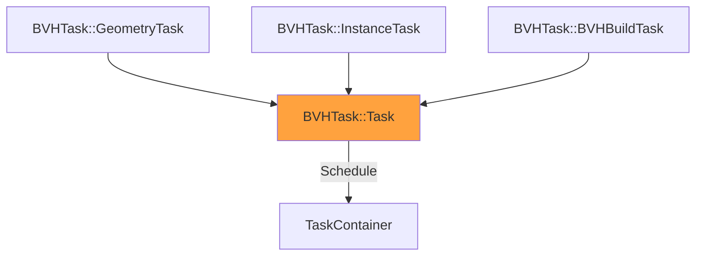
- *GeometryTask*
Task for constructing and updating the Bottom Level Acceleration Structure with the vertex buffer and index buffer as input.  
- *InsntanceTask*
This task is used to place the BLAS generated by the GeometryTask above in the Top Level Acceleration Structure and update its position.  
- *BVHBuildTask*
This task doesn't have any of geometry data, instead, it has parameters to control building BLAS and TLAS in the SDK.  

###### Render tasks
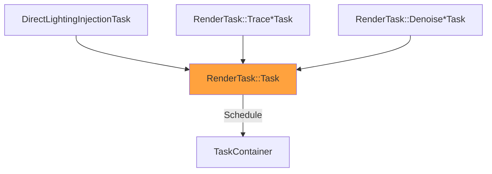
Render tasks can be divided into the following three types of processing.
- *Direct Lighting Injection task*  
DirectLightingInjection is a task that writes the result of direct lighting buffer (a 2D input texture) into the Direct Lighting Cache built by the SDK in world space. By performing this process from various views over multiple frames, the direct lighting rendering results are accumulated in world space. This Direct Lighting Cache is then referenced in the following ray tracing reflection processes.  

- *TraceTasks (for specular, diffuse reflections, ambient occlusion and shadows)*  
These are tasks that perform ray tracing in the acceleration structure built by the SDK.  
Specular/Diffuse Reflection tasks use the input GBuffer's surface as the starting point of reflection rays. They perform ray tracing to sample the direct lighting cache to estimate incoming radiance to the surface. Ambient Occlusion also uses the input GBuffer as the starting points of the AO rays, but does not use the direct lighting cache, and draws AO only by checking the intersection with the acceleration structure.  Shadow tasks trace shadow rays from the GBuffer’s surface to the light source based on the light source information input with the RenderTask.  

- *DenoisingTasks (for specular, diffuse reflections, ambient occlusion and shadows)*  
Denoising tasks are for denoising the various rendering results output by the ray tracing task above. KickStart RT performs denoising tasks by calling into NVIDIA's NRD library internally. There are denoising tasks for Specular, Diffuse, Ambient Occlusion and Shadows, and these are used with the corresponding ray tracing tasks.  
These tasks need an intermediate render target to perform multi-pass rendering, and it is represented with Denoising Context Handle in the SDK (described later).  

#### Log
Log is a namespace that contains functions to control the output of error and other kind of messages from the SDK, which can be suppressed or retrieved by setting up a callback function and then processed by the application.

#### Version
The namespace that stores the version number of the SDK. When initializing, the SDK passes the version number described in the header file as the default argument, compares it with the version number in the library’s binary and displays an error or message if it differs and doesn't have compatibility.

#### Math
This is a namespace for some vector and matrix types. They are used as input data types for various tasks.

## 3. Handles
There are four types of handles in the SDK, all of which are generated from an Execute Context and persist unless explicitly destroyed or returned. The application must correctly manage the handle lifetimes along with the ExecuteContext across multiple frames.

#### Geometry Handle
GeometryHandle is used to identify the geometry registered by the application. Once a geometry is registered, the geometry will remain in the SDK until it is explicitly destroyed. If the geometry (vertex position in local coordinates) changes, it needs to be updated by using the Geometry Handle as the identifier.
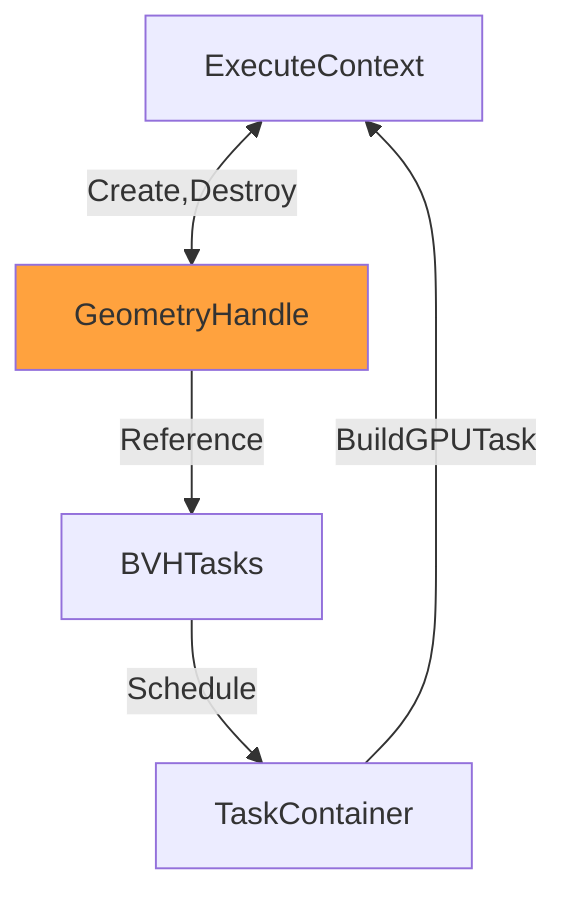

#### InstanceHandle
An Instance is used to place a Geometry in world space. Once it is placed, the instance continues to exist in world space until it is explicitly destroyed. It needs to be updated if its location (4x3 matrix) changes. To accomplish this, an InstanceHandle is provided as an identifier for an instance.
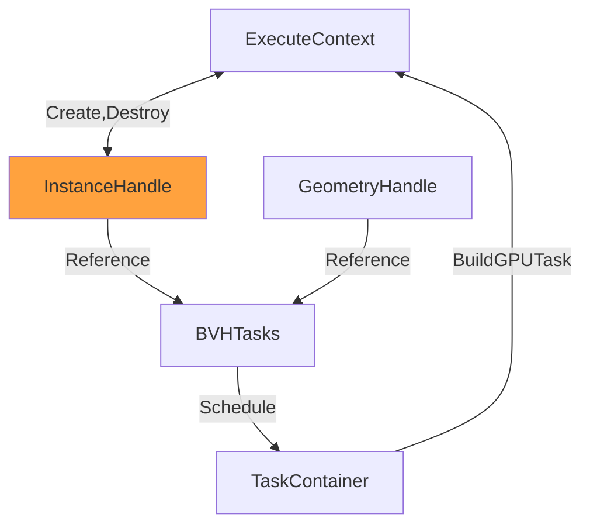


#### DenoisingContextHandle
The DenoisingContextHandle is a handle that holds an intermediate render target needed for denoising the ray tracing result with multi-pass rendering. The resource will continue to be held until the corresponding handle is explicitly destroyed. While it is preferable to reuse the intermediate render target as long as the rendering resolution does not change, it will need to be destroyed and recreated if the resolution changes or the rendering settings change. A DenoisingContextHandle is provided to the various denoising render task structures as an identifier for an intermediate render target for denoising. It is advisable to reuse a denoising context if possible to reduce held resources.
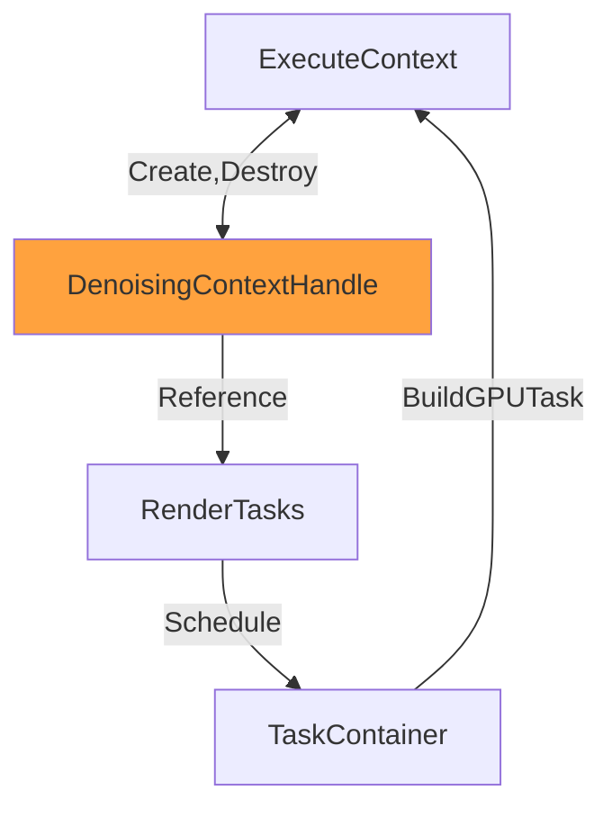

#### GPUTaskHandle
A GPUTaskHandle is passed back to the application by the SDK when a command list is built in order to track execution. As the SDK does not interact with the GPU's execution queue at all, the application must notify the SDK when the corresponding GPU processing has been completed by returning the GPUTaskHandle. The SDK will then know when the GPU processing is complete and can safely release or reuse the resources that have been used by the built command List. The application should call MarkGPUTaskAsCompleted() to return GPUTaskHandle to the SDK as soon as possible.

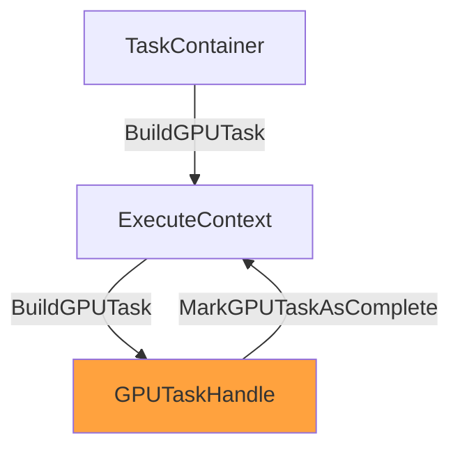
When initializing the SDK, "supportedWorkingsets" in the ExecuteContext_InitSettings structure corresponds to the maximum number of command lists that can be in-flight at the same time. If it is set to a large number, many command lists can be put into the GPU’s execution queue at the same time.  However, if it is unnecessarily large, unused resources will be allocated internally to the SDK, which is a waste. Please set it appropriately for the workloads and execution environment.

## 4. Threading  
The SDK does not create worker threads internally. This is to keep the SDK itself simple and to allow seemless integration with the applications native threading system. This chapter explains how to use the SDK with multithreading.

#### Multithreaded implementation using multiple task containers
An ExecuteContext creates a TaskContainer and can schedule various tasks to it. Since multiple task containers can be created and each of them has no exclusions, they can be handled efficiently on multiple threads.
There is **one exception** which is the BuildGPUTask call to ExecuteContext.  This call is blocked by a mutex even if it is called from multiple threads because there is a dependency between the acceleration structure update by the BVH Task and the GBuffers used by the Render Task, so their execution order should be clearly defined. Additionally, the command list generated by the SDK needs to be executed on the GPU in the order in which it was generated.

#### Lifetime of handles and BuildGPUTask
Each handle is referenced by a task and it is stored in a task container and eventually used in a command list. Tasks are stored in a TaskContainer while handles are created and destroyed via ExecuteContext. After destroying the handle referenced by a task the handle will become invalid.  Thus if you call BuildGPUTask with that task container to schedule it, the invalid handle will be detected during the call and an error will occur.
However, even if a handle is destroyed after BuildGPUTask is called, the actual destruction of the resources inside the SDK will occur in the first BuildGPUTask call after the corresponding GPUTaskHandle is returned to the SDK (which indicates GPU execution has completed).

While this lazy destruction behavior is convenient for creating and destroying handles in the ordinal rendering loop, it can cause problems in cases where large numbers of release and allocation of handles occur, such as level loading.  In these situations, the required VRAM is doubled for a short time. In such a case, VRAM can be released immediately by calling ReleaseDeviceResourceImmediately. Please note that for this call to function properly **all SDK built command lists must be completed and all GPUTaskHandles must be returned**.

## 5. Mutex and Blocking Conditions in the SDK
There are three mutexes used in the SDK that an application needs to consider.

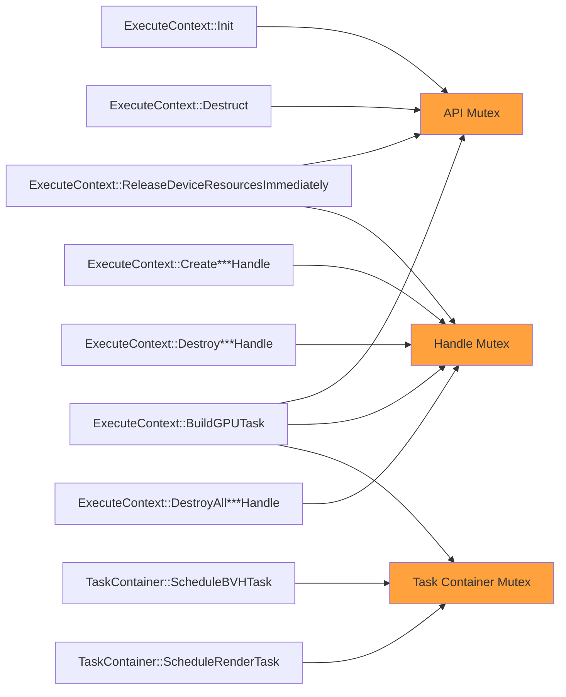

#### API Mutex
Functions which need to acquire this mutex completely exclude re-entrants and other calls. 

#### Handle Mutex
This is a mutex to avoid conflicts between handle creation and destruction processes. BuildGPUTask only locks the mutex at the beginning of the process, but releases it as soon as possible after the processing list is copied.

#### Task Container Mutex
This is a mutex that is held by each task container to prevent further scheduling of tasks when getting built. Once it has been passed as an argument to BuildGPUTask, the mutex will be locked and the task container will eventually be destroyed by the SDK.

## 6. Input Resources
There are a variety of input resources from the application to the SDK. In order for the SDK to process the input resources correctly, the following rules must be observed.

#### Supported Resource types and formats
Supported resource types and formats depend on the individual Task. Please refer to the source code and headers as an API reference for details.

#### Resource life time
All input resources must not be destroyed until the application returns a GPU Task Handle for the command list built with a scheduled task using the resource. **The SDK doesn't increment the reference counter of the D3D resource**. Therefore, discarding a resource while using it in the SDK or command list built by the SDK will result in unpredictable behavior.

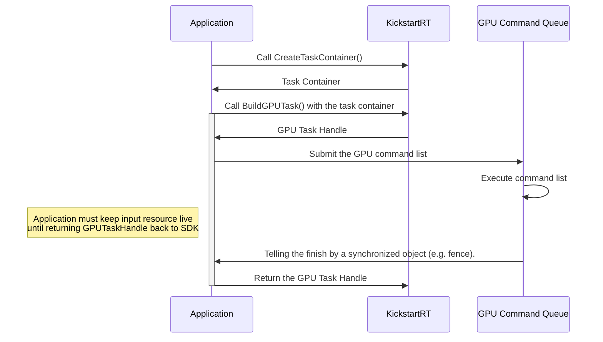

#### Resource states
All input resources to the SDK have expected resource states. These are shown in the table below.

The only complicated case is Reflection, AO or Shadows drawn by SDK and then denoising them with tasks in the same task container. In this case, the same resource is used for both input and output of render tasks and **resource transitions are performed inside the SDK**. The application only needs to set the resource state to the expected one for the first use in the scheduled render tasks.

If a resource state transition is made inside the SDK, then the SDK will transition it to the expected resource state before handing it back to the application. Note that the **SDK doesn't know the actual original resource state, so it will be set to the expected resource state**. This should be fine as long as the application keeps the SDK's expected resource state.

When using D3D12, the SDK will set AssertResourceState if the debug command list interface is available in the debug build, to verify all input resource states are set correctly. In other cases, the SDK does not check the input resource states.

When using Vulkan, besides meeting the expectation of image layout for textures, all resources must satisfy the pipeline barrier to safely consume resources at the compute shader stage. 

| Input Resources | Expected Resource State in D3D12 | Expected VkImageLayout and VkAccessFlagBits in VK |
| ---- | ---- | ---- |
| BVHTask::VertexBufferInput | NON_PIXEL_SHADER_RESOURCE | VK_ACCESS_SHADER_READ_BIT |
| BVHTask::IndexBufferInput | NON_PIXEL_SHADER_RESOURCE | VK_ACCESS_SHADER_READ_BIT |
| RenderTask::ShaderResourceTex | NON_PIXEL_SHADER_RESOURCE | VK_IMAGE_LAYOUT_SHADER_READ_ONLY_OPTIMAL,  VK_ACCESS_SHADER_READ_BIT |
| RenderTask::UnorderedAccessTex | UNORDERED_ACCESS | VK_IMAGE_LAYOUT_GENERAL,  VK_ACCESS_SHADER_WRITE_BIT |
| RenderTask::CombinedAccessTex | UNORDERED_ACCESS | VK_IMAGE_LAYOUT_GENERAL,  VK_ACCESS_SHADER_WRITE_BIT |


## 7. D3D11 interlop layer
This chapter covers the SDK's D3D11 interlop layer which is different from the SDK's native layers built on D3D12 or Vulkan. 

#### D3D12 backend
The D3D11 interop layer uses the D3D12 version of the SDK internally as a native layer. Whilst the native layer variant of the SDK does not touch any command queues, the interop layer creates the D3D12 Device and CommandQueue internally and executes the command list built by the native layer SDK. D3D11 and D3D12 execution queues are synchronized with  a Fence Object, introduced in D3D11.3, by inserting the D3D11 Fence before and after the SDK-generated command list.  
The following is the execution flow.

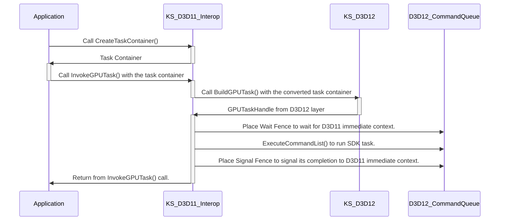

And the following is a sequence diagram focusing on the GPU execution queue. The two D3D11 and D3D12 execution queues are synchronized by placing the fence objects.
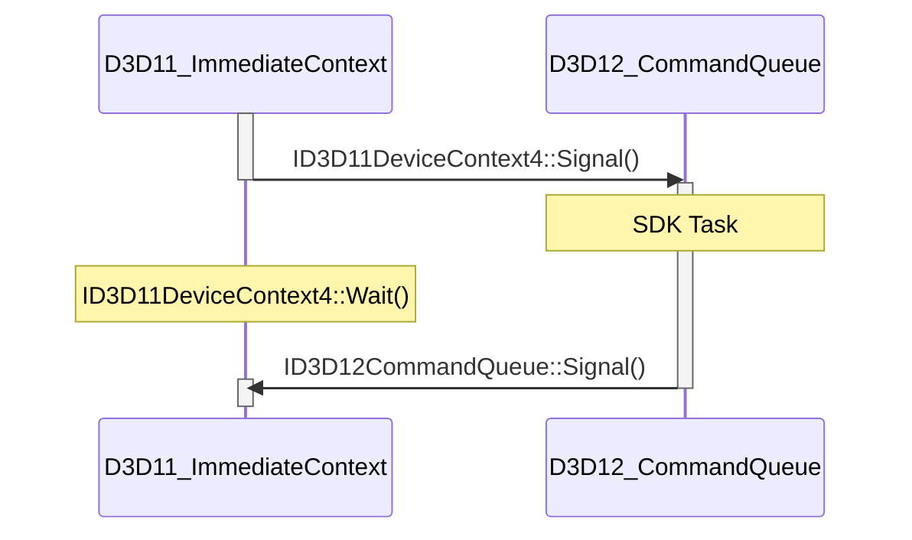

#### API Differences
The D3D11 interop layer has slightly different APIs from the native layer SDK. There is no `GPUTaskHandle` because the command list is generated and executed internally by the SDK. `InvokeGPUTask()` takes care of everything from command list generation to execution.
```
#if !defined(KickstartRT_ExecutionContext_Interop)
enum class GPUTaskHandle : uint64_t { Null = 0 };
#endif
.
.
.
#if defined(KickstartRT_ExecutionContext_Interop)
	virtual Status InvokeGPUTask(TaskContainer* container, const BuildGPUTaskInput* input) = 0;
#else
	virtual Status BuildGPUTask(GPUTaskHandle *retHandle, TaskContainer *container, const BuildGPUTaskInput* input) = 0;
	virtual Status MarkGPUTaskAsCompleted(GPUTaskHandle handle) = 0;
#endif
```

#### Sharing resources between D3D11 and 12
In the interop layer, the same resource needs to be referenced by D3D11 and D3D12. Therefore, all D3D11 resources input to the SDK must have `D3D11_RESOURCE_MISC_SHARED` applied. Also, the Fence Object must have `D3D11_FENCE_FLAG_SHARED` applied; the SDK internally generates shared handles and passes them to the D3D12 layer.

The interop layer caches the generated shared handles internally because the resources referenced in the D3D12's command list need to be alive until the D3D12 command queue has completed the execution of the command list. It also reduces the overhead of frequently creating new shared handles for the same resource.  

The lifetime of the cache is up to the first call to `InvokeGPUTask()` after the used D3D12CommandList has completed execution. If there is a in-flight GPU task using a resource, the corresponding cache entry will not be released. On the other hand, if there is a CPU and GPU synchronization, you can clear all entries of the cache by calling `ReleaseDeviceResourcesImmediately()`.

## 8. Internal Resources
This section describes the resources that the SDK creates and uses internally. If you simply want to use the SDK, you don't need to read through this chapter and can skip it.

#### Descriptor Heap and Constant Buffer
When the SDK builds a command list from a Task Container, it uses a set of a descriptor heaps and a constant buffer that the SDK internally manages. They are managed by a class named TaskWorkingSet. When performing ray tracing, the SDK generates a descriptor table based on the number of registered instances and is approximately twice as large. Therefore, if a large number of Instances are registered, the descriptor heap may not be able to allocate memory and an error may occur.

The SDK does not dynamically change the size of the descriptor heap. The size of the descriptor heap can be set in the ExecuteContext_InitSettings structure when initializing the SDK. If this value is too large it will be a waste of memory, and if it is too small it will cause an error if too many instances are registered. Choose an appropriate value according to the contents.

#### Buffers for Index and Vertex Buffers
The index and vertex buffers provided by the application are copied to an internal buffer along with transformations, index reordering, and other processing. These buffers are allocated in a shared buffer, meaning that one large buffer accommodates multiple geometries. This reduces the frequent VRAM allocation and deallocation.  

For static geometry, the buffer is released when its BLAS has been built, but for dynamic geometry (that regularly updates its vertex positional data ie. skinned geometry) is not released even after the BLAS is built. Therefore, static and dynamic geometry are managed in different shared buffers.  

By generating a copy of the vertex buffer, the SDK can control the number of BLASs created per BVHBuildTask in order to adjust the BLAS creation load. This can be controlled by the application when scheduling the TLAS build task per frame.

#### Buffers for Direct Lighting Cache
The Direct Lighting Cache is a buffer for storing the direct lighting result over the surfaces of the instances input to the SDK. Along with the vertex buffer copy process described above, the SDK internally calculates the size of this buffer for each geometry based on the surface area of the polygon and its edge length. The SDK reads back the calculated size from the GPU to the CPU side to reserve a buffer for actual direct lighting storage. For these processes, buffers for read back and atomic counters are required. Since it is not memory efficient to allocate many small buffers, these buffers are shared within the SDK.

#### Buffers for BLAS, TLAS
Buffers for BLAS construction also use shared buffers, but they are divided into several types depending on their use. 

A scratch buffer is required for BLAS construction. The buffer for BLAS and scratch buffer are managed in separate shared buffers. In addition, the SDK internally performs BLAS compactions on static geometries. Therefore, there are four types of shared buffers for BLAS.

TLAS, on the other hand, uses dedicated buffers that are not shared.

#### Intermediate render targets for denoising
The intermediate render target for denoising is explicitly managed by the application using the DenoisingContextHandle, but the actual memory management is done by the SDK.  One point to note is that after calling Register and Destroy in ExecuteContext, the actual creation and destruction of resources are done lazily in the next BuildGPUTask call.

